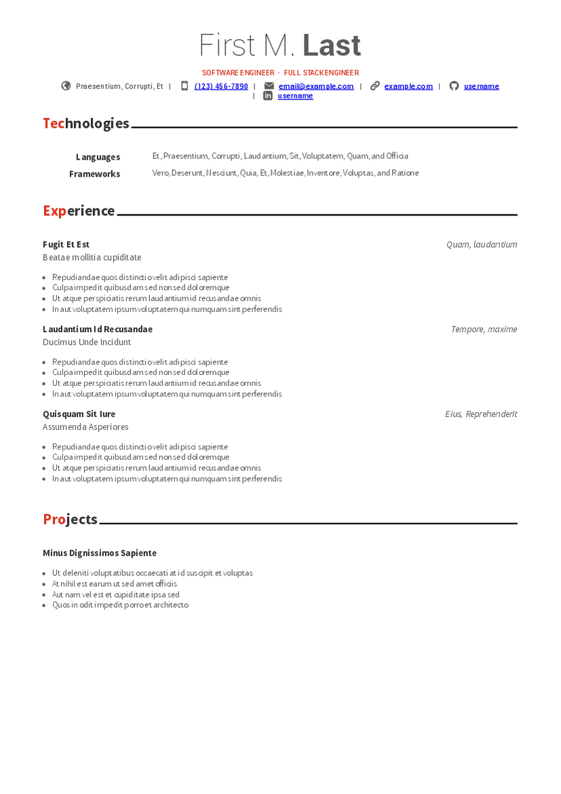

# Awesome CV Astro

A fork of [awesome-cv-react](https://github.com/sygint/awesome-cv-react) to [Eleventy](https://www.11ty.dev/) and now [Astro](https://astro.build/). This fork has easier markup and generation Astro and style via vanilla CSS. It has the same easy configuration via YAML.

## Preview

You can see [PDF](build/resume.pdf)

[](build/resume.pdf)

# Getting Started

This project is powered by [Astro](https://astro.build/).

# Configuration

All of the config is found in `resume-details.yaml` in the root directory. It's fairly self explanatory, feel free to hit me up if you have any questions.

## Project Structure

Inside of your Astro project, you'll see the following folders and files:

```text
/
...
├── public/
├── scripts/
│   ├── build.ts
│   ├── convertToPdf.ts
│   └── convertToPng.ts
├── src/
│   ├── components/
│   ├── fonts/
│   ├── pages/
│   │   └── resume.astro
│   └── style/
...
```

`./dist` - Generator build output

`scripts/` - Scripts for pdf and png generation

`src/` - Resume source code

`src/components/` - Resume components

`src/fonts/` - Fonts used

`src/pages/resume.astro` - Main resume layout file

`src/styles/` - CSS used for styling resume

Any static assets, like images, can be placed in the `public/` directory.

## Commands

All commands are run from the root of the project, from a terminal:

| Command                    | Action                                                    |
| :------------------------- | :-------------------------------------------------------- |
| `pnpm install`             | Installs dependencies                                     |
| `pnpm dev` or `pnpm start` | Starts local dev server at `localhost:4321`               |
| `pnpm build`               | Build your resume to `./dist/` and convert to PDF and PNG |
| `pnpm preview`             | Preview your already built resume in the browser          |

## Work In Progress

There are many features supported by awesome-cv that are yet to be supported in this, including Honors & Awards, Certifications, and Education, as well as the cover letter.

I hope to work on these in the near future.
