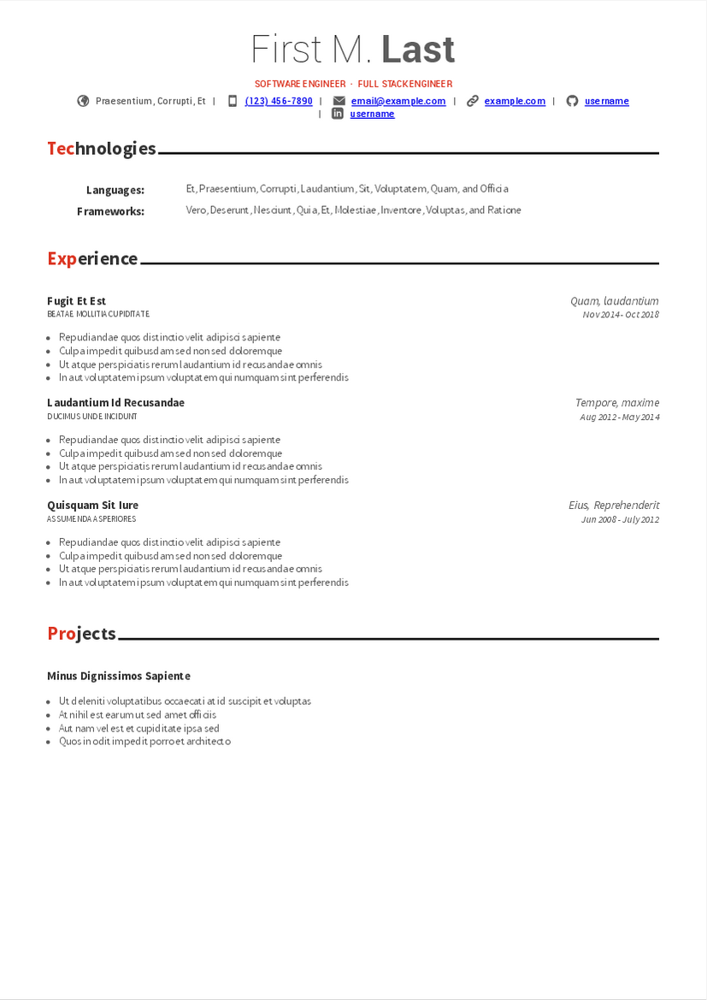
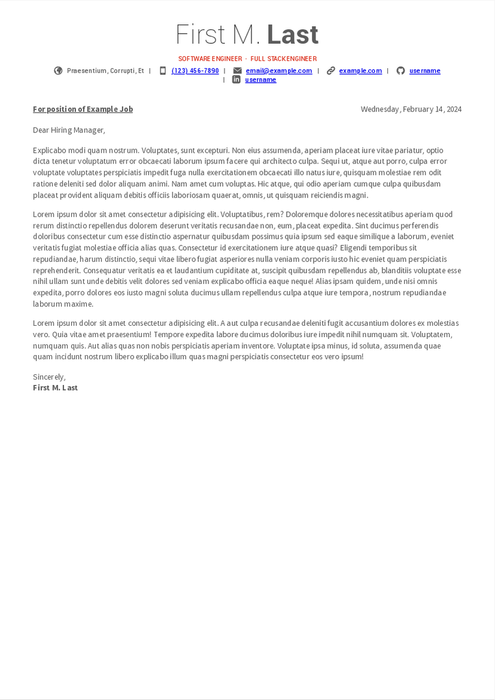

# Awesome CV Astro

A fork of [awesome-cv-react](https://github.com/sygint/awesome-cv-react) to [Eleventy](https://www.11ty.dev/) and now [Astro](https://astro.build/). This fork has easier markup and generation via Astro and style via vanilla CSS. It has the same easy configuration via YAML.

## Preview

| Resume | Cover Letter |
|:---:|:---:|
| [](build/First-M-Last.pdf)  | [](build/cover-letter.sample.pdf) |

# Getting Started

This project is powered by [Astro](https://astro.build/) and uses [Playwright](https://playwright.dev/) for PDF and PNG generation.

## Prerequisites

- Node.js 20 or later
- pnpm (recommended) or npm

### NixOS / devenv Setup

This project includes a `devenv.nix` configuration for NixOS users. The devenv setup:

- Provides Node.js 20 and pnpm
- Configures Playwright to use pre-patched browsers from nixpkgs
- Uses Playwright 1.54.1 (matching nixpkgs version)
- Sets up all necessary environment variables automatically

To use devenv:

```bash
# Install devenv if you haven't already
# See: https://devenv.sh/getting-started/

# Enter the development shell
direnv allow

# Or manually activate
devenv shell
```

The devenv configuration handles all Playwright browser setup automatically - no need to run `playwright install`.

### Standard Setup (non-NixOS)

If you're not using NixOS/devenv:

```bash
pnpm install
npx playwright install chromium
```

# Configuration

All of the config is found in `resume-details.yaml` in the root directory. It's fairly self explanatory, feel free to hit me up if you have any questions.

## Project Structure

Inside of your Astro project, you'll see the following folders and files:

```text
/
...
├── public/
├── scripts/
│   ├── build.ts
│   ├── convertToPdf.ts
│   └── convertToPng.ts
├── src/
│   ├── components/
│   ├── fonts/
│   ├── pages/
│   │   └── resume.astro
│   └── style/
...
```

`./build` - Generator build output (configured in astro.config.mjs)

`scripts/` - Scripts for PDF and PNG generation using Playwright

`src/` - Resume source code

`src/components/` - Resume components

`src/fonts/` - Fonts used

`src/pages/resume.astro` - Main resume layout file

`src/styles/` - CSS used for styling resume

Any static assets, like images, can be placed in the `public/` directory.

## Commands

All commands are run from the root of the project, from a terminal:

| Command                    | Action                                                    |
| :------------------------- | :-------------------------------------------------------- |
| `pnpm install`             | Installs dependencies                                     |
| `pnpm dev` or `pnpm start` | Starts local dev server at `localhost:4321`               |
| `pnpm build`               | Build your resume to `./build/` and convert to PDF and PNG |
| `pnpm build-pdf`           | Generate PDF and PNG from already-built HTML              |
| `pnpm preview`             | Preview your already built resume in the browser          |

## How PDF and PNG Generation Works

The `pnpm build` command:

1. Runs `astro build` to generate static HTML in `./build/`
2. Uses Playwright to load the HTML files directly from the filesystem (no server needed)
3. Generates:
   - PDF files from the HTML pages (with print media CSS)
   - High-resolution PNG screenshots for previews
   - Processes both resume and cover letter pages

The conversion scripts (`convertToPdf.ts` and `convertToPng.ts`) use Playwright's Chromium browser with `file://` URLs to load HTML directly from disk, ensuring accurate rendering with proper font loading and CSS application.

**Note**: On NixOS, the devenv configuration automatically uses pre-patched Playwright browsers from nixpkgs, eliminating the need for manual browser installation or patching.

## Work In Progress

There are many features supported by awesome-cv that are yet to be supported in this, including Honors & Awards, Certifications, and Education, as well as the cover letter.

I hope to work on these in the near future.
